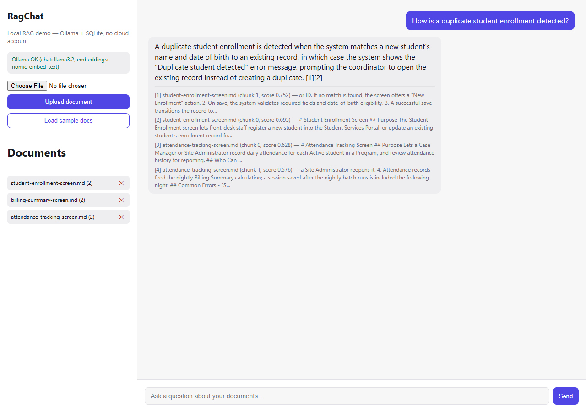

# RagChat

A from-scratch RAG (Retrieval-Augmented Generation) document chat API and minimal
web UI, built as a personal learning/portfolio project. Upload a document, ask
questions about it, get answers grounded in the document with citations.

Everything runs **locally, for free, with no cloud account and no API keys**:
[Ollama](https://ollama.com) provides the chat model and the embedding model, and a
local SQLite database stores the document chunks and their embedding vectors. Vector
search is a plain in-code cosine-similarity scan — no external vector database.



## Why this exists

This started from watching a YouTube tutorial that wired an ASP.NET Core API to Azure
Blob Storage, Azure AI Search, and Azure OpenAI. That tutorial's repo never actually
contained the RAG pipeline itself — indexing was done by Azure AI Search's portal
wizard, the "search" was plain keyword search rather than vector search, and the chat
service had a bug that returned the raw serialized completion object instead of the
answer text. This project implements the real pipeline in code instead, so it's
actually useful to learn from: text extraction → chunking → embedding → vector
storage → retrieval → grounded generation → citations.

## Architecture

```
RagChat.Api/
├── Controllers/
│   ├── DocumentsController.cs   upload / list / delete / seed sample docs
│   ├── ChatController.cs        POST a question, get a grounded answer + citations
│   └── HealthController.cs      is Ollama reachable, which models are configured
├── Services/
│   ├── TextExtractors.cs        .txt/.md/.pdf/.docx -> plain text
│   ├── TextChunker.cs           overlapping word-window chunking
│   ├── OllamaClient.cs          talks to the local Ollama REST API (embed + chat)
│   ├── VectorSearchService.cs   cosine-similarity top-K search over stored chunks
│   ├── DocumentIngestionService.cs   orchestrates extract -> chunk -> embed -> store
│   ├── RagChatService.cs        orchestrates retrieve -> prompt -> generate -> cite
│   └── SampleDocsSeeder.cs      loads sample-docs/*.md for a no-setup demo
├── Data/RagDbContext.cs         EF Core + SQLite: Documents, DocumentChunks
├── sample-docs/                 fictional "Student Services Portal" screen docs
└── wwwroot/                     single-page vanilla-JS chat UI (upload + chat)

RagChat.Tests/                   xUnit tests for the chunker and the vector math
```

## Prerequisites

1. **.NET 9 SDK** — already required to build this.
2. **[Ollama](https://ollama.com)** — install it yourself from the official site (a
   normal desktop app install, no account needed). Then pull the two models this
   project uses by default:
   ```powershell
   ollama pull llama3.2
   ollama pull nomic-embed-text
   ```
   Ollama listens on `http://localhost:11434` once running — no API key required.

## Run it

```powershell
dotnet restore RagChat.sln
dotnet run --project RagChat.Api/RagChat.Api.csproj
```

Open the URL shown in the console (default `http://localhost:5236`). The page shows
whether Ollama is reachable. Click **Load sample docs** to seed the three fictional
"Student Services Portal" screen docs, then ask something like:

- "What roles can access the Attendance Tracking screen?"
- "What happens if I try to submit a billing period with unlocked sessions?"
- "How is a duplicate student enrollment detected?"

Swagger UI is available at `/swagger` in Development.

## Test

```powershell
dotnet test RagChat.sln
```

Tests cover the chunking logic and the cosine-similarity/vector-serialization math —
the two pieces of actual algorithmic work in the pipeline. They don't require Ollama
to be running.

## How the RAG pipeline works here

**Ingestion** (`DocumentIngestionService`): extract text → split into ~250-word
chunks with 50-word overlap (`TextChunker`) → embed each chunk via Ollama's
`nomic-embed-text` model → store the chunk text and its embedding (as a `BLOB`) in
SQLite.

**Retrieval + generation** (`RagChatService`): embed the user's question with the
same embedding model → cosine-similarity search the stored chunk embeddings → take
the top 4 → build a numbered context block from them → ask the chat model to answer
using *only* that context and cite excerpt numbers → return the answer plus a
citations list (document name, chunk index, similarity score, excerpt) so the UI can
show where the answer came from.

## Known limitations (deliberate, for a demo-scale project)

- Vector search is a brute-force scan over every stored chunk — fine for a personal
  document set, not for a large corpus (a real vector index would be needed there).
- Chunking is word-count based, not model-token based — simpler, dependency-free, and
  close enough for a demo.
- No auth — this is a local single-user demo, not something to expose publicly as-is.

## Sample documents

`sample-docs/` contains three fictional, made-up screen-flow docs for a "Student
Services Portal" (enrollment, attendance, billing) — written in the same style as
internal product documentation, but entirely invented for this demo. They do not
contain any real product content.

## License

[MIT](LICENSE)
